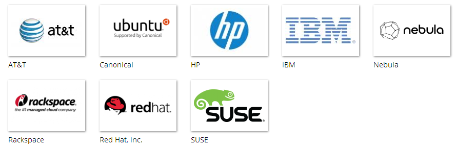
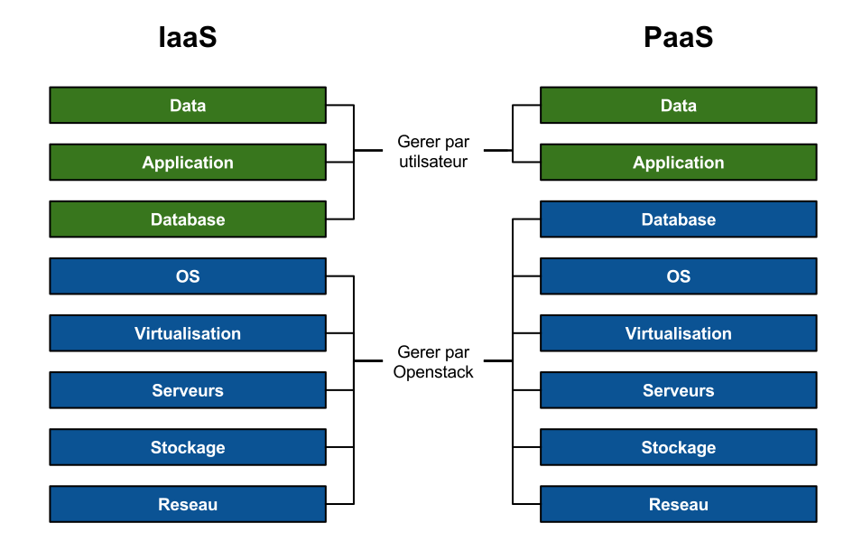
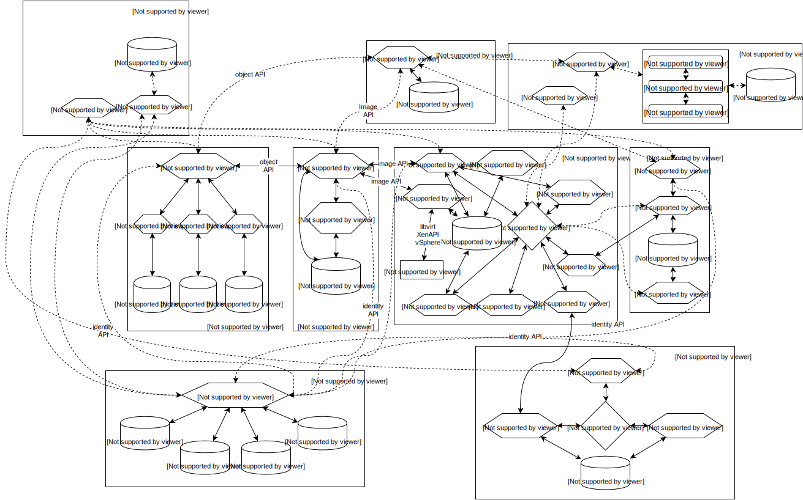
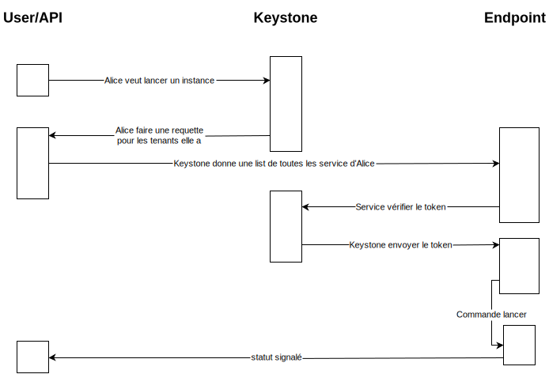
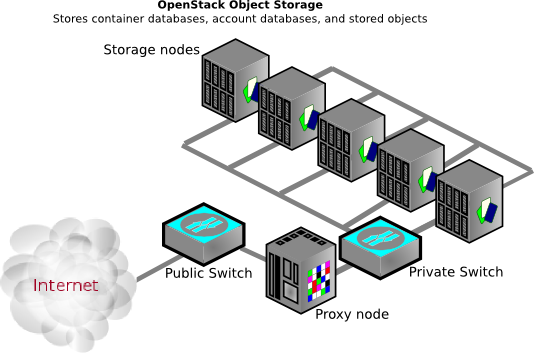
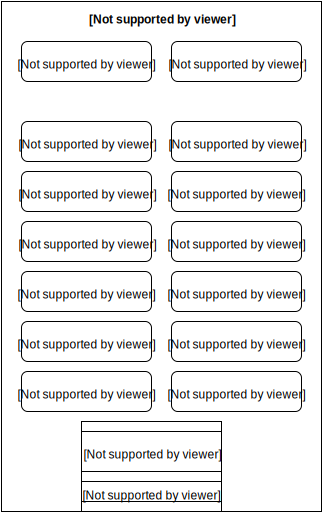
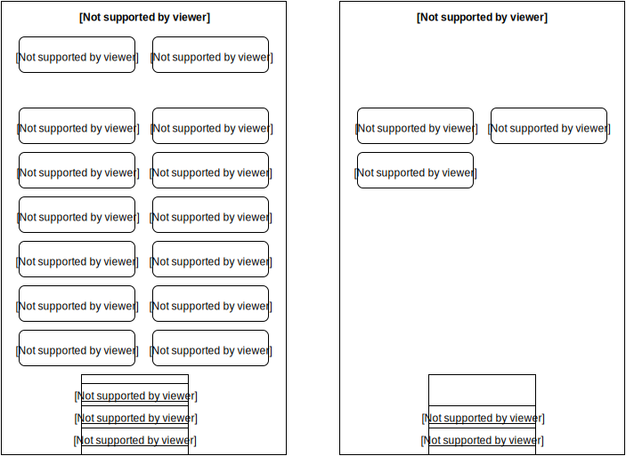

# Openstack pour les nuls

## Une introduction à Openstack

Créé par [Chris Cowley](https://chriscowley.me.uk) / [@chriscowleyunix](http://twitter.com/chriscowleyunix) et Sylvain Révéreault [@srevereault](http://twitter.com/srevereault)

 

Note: What I will cover.
- This work is licensed under a [Creative Commons Attribution-ShareAlike 4.0 International License](http://creativecommons.org/licenses/by-sa/4.0/)

---

## Agenda

Qu'est que c'est?

Éléments

Chaque élément fait quoi?

Comments utiliser?

Types d'architecture

---

## Qu'est que c'est (pas)?

Ce n'est pas un hyperviseur

Ce n'est pas une platforme de stockage

Ce n'est pas une alternative a VMware ESX ou vSphere (equivalent a vCloud Director)

Ce n'est même pas un seul projet.

Note:
- The hypervisor is just one part of it
- Not even an essential part
- Once again, only part of it.
   - Several types of storage in Openstack (more later)
- VMware can be part of an Openstack cloud

----

## Donc, qu'est que c'est?

Un groupe de projets pour gérer des service cloud

Supporté par la Openstack Foundation

Aujourd'hui concentré sur IaaS

Les éléments de PaaS commencent à venir

Note:

----

## Openstack Foundation

Et beaucoup plus ... même Orange

Et Moi

----

## IaaS/PaaS?

Note:

---

## Composants Openstack

- Nova
- Swift
- Glance
- Keystone
- Horizon
- Neutron
- Cinder
- Ceilometer
- Heat
- Trove (New in Icehouse)
- Oslo

Note:

----

## Projets en Incubation

- Ironic
- Triple-O
- Zaqar
- Sahara
- Barbican
- Designate
- Manila
- d'autres ?

Note:
- These are all slated for inclusion in the 2-3 releases.
- Big ones are:
    - Ironic (bare-metal)
    - Triple-o (automated platform provisioning)

---

## Communication entre les composants

Note:
- Not really to show actual info
- More just to show that it is complex

----

## Ce n'est pas tout

Je n'ai pas mis:

- Trove
- Oslo
- Tous les projets en incubation

Note:

You thought it was complex before, when all that comes onboard there will be a lot to break

---

# Qui fait quoi

----

## Keystone

Identification et autorisation

Utilisé par tous les autres modules.

Note:
- Pretty much everything hits Keystone
- Token based
- Being expanded to support OpenID/Oauth
   - Allow you tenants to auth with their G+ account
   - Authenticate your apps to Keystone?
- Can be used outside Openstack (especially with the coming OpenID/Oauth support)

----

## Glance

Gère les templates

Accepte les requettes des utilisateurs pour les images et metadata

Templates stockés dans Swift/S3, FS ou HTTP

Note:
- Oddly the first place you will see network problems
- Huge library already exists (Linux and Windows)
- Can also be used outside Openstack (oVirt and RHEV-M)

----

## Nova

Gère tout les instances (openstack-lish pour VM)

Decide quel neud utiliser pour un instance

Une instance est "stateless"

Plugins pour plusieurs hyperviseurs (ou pas) - on peut utiliser LXC ou meme "bare-metal"

Note:
- KVM/Libvirt
- vSphere (pas ESX)
- Xen/XenServer
- LXC
- Bare metal
- Même Hyper-V

----

## Cinder

Provisionne le stockage persistant pour les instances

On peut l'utiliser pour /, mais ce n'est pas le comportement par défaut

Plugins existent pour tout entre LVM et EMC VMAX

Note:
- The root FS for each instance exists on Ephermeral storage (by default)
- Destroy instance = destroy data!
- Also used outside Openstack

----

## Swift

Stockage Objet

Utilisé par d'autres services (Glance par exemple)

Aussi utilisé en direct

Pas seulement un format du stockage, mais un "dialecte" du stockage

Note:
- Object storage allows much greater resilience/scalablity than RAID/replication
- not really geared to performance
- Swift is not just the storage side, but also a API dialect.
  - Ceph and Gluster both talk Swift (and Cinder too)

----

## Neutron

Software Defined Networking (SDN)

Mon preféré

Les "tenants" peuvent gérer leur propre réseau avec les FWs, LBs et VPNs

Possiblité d'ajouter les IP externes pour les instances qui en ont besoin

Plugins pour Openvswitch, Cisco Nexus, VMware NSX, Brocade, BigSwitch, et d'autres

Un plugin L2 modular

Note:

- Not really my favourite
- This is broken when image deployments from Glance stop EVERYTHING!

----

## Heat

Orchestration basée sur les templates

Avec un fichier on peut créer toute une infrastructure

- Instances
- Reseaux
- Stockage
- Accès externe

Note:
- Don't know much about it (yet)

----

## Horizon

Interface web pour gérer Openstack

Utilisé par l'admin et les utilisateurs

Pas essentiel - les APIs sont des "citoyens de première classe"

Horizon utilise ces APIs

Note:
- Based on Django
- Not the best way to manage Openstack, especially at scale

----

## Ceilometer

Collecte de metrics (physique ou virtuelle)

Stockage de ces infos

Principalement pour la facturation des tenants.

Note:
- Like Heat, not a module I have really used much
- Other than looking at pretty graphs

----

## Trove

DBaaS (Database as a Service)

SQL (MySQL) ou NoSQL (MongoDB)

----

## Oslo

Les API partagées

Note:
- VERY important
- The glue that holds the whole collection together

---

## Les nouvelles règles

Rappel : Openstack n'est pas un alternative a vSphere

Note:
- No HA (Sylvain : dépend de la façon dont c'est déployé)
- No vMotion (pas d'accord : tu as des mécanimses de Live Migration)
- No failover

----

## Pense Fourmis, pas Chat

Note:
- Kill some ants and the colony will continue
- Contrary to popular belief, a cat does not have 9 lives

----

## Instances are stateless

Les instances sont jetables

Mettre tout les données dans Cinder/Swift

Note:
Do your HA at an application level, not server

----

## Rappeler le "Chaos monkey"

Note:
- Netflix program that randomnly kills PRODUCTION instances

---

# Comment tester

----

## Trystack

Le plus simple - c'est dans le cloud

Il faut avoir un compte Facebook

http://trystack.org

----

## Red Hat RDO

Un projet Redat pour créer les labs et PoCs

http://openstack.redhat.com

Limité a RHEL, CentOS et Fedora

----

## Puppet

Sur la Forge, il y a des modules pour installer/gérer Openstack

Compatible avec RHEL/CentOS et Ubuntu LTS

Utilisé par RDO

Plus souple de RDO

----

## Juju

Projet d'orchestration pour Ubuntu

Note: (Sylvain) il y a aussi DevStack (http://docs.openstack.org/developer/devstack/) qui fait maintenant officiellement partie d'OpenStack

---

# Architectures

----

## 1 node?

Note:
- Does scale, but is very simple of lab/PoC use
- Exactly what is used for development

----

## 2 Node

Note:
This one scales nicely. Basic architecture can be used for much larger setups

----

## HA cluster

---

# Demo

Ça va finir mal :-)

Note:
- Use [Trystack](http://trystack.org/)
- (Sylvain) si besoin, on peut mettre un DevStack sur une machine SII

---

# Questions?
