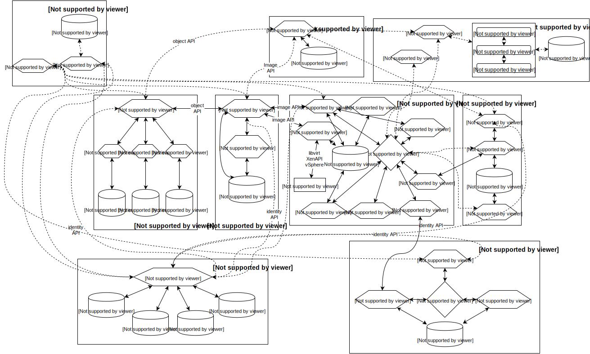

# Openstack pour les nulls

## Un introduction a Openstack

Créer par [Chris Cowley](https://chriscowley.me.uk) / [@chriscowleyunix](http://twitter.com/chriscowleyunix)

 

Note: What I will cover.
- This work is licensed under a [Creative Commons Attribution-ShareAlike 4.0 International License](http://creativecommons.org/licenses/by-sa/4.0/)

---

## Agenda
						
Qu'est que c'est?
						
Éléments
						
Chaque éléments fait quoi?
						
Comments utiliser?

Types d'architecture

---

## Qu'est que c'est (pas)?

Il n'est pas un hypervisor

Il n'est pas un platform de stockage						

Il n'est pas un alternative a VMware					

Il n'est même pas un seul projet.

Note:
- The hypervisor is just one part of it
- Not even an essential part
- Once again, only part of it.
   - Several types of storage in Openstack (more later)
- VMware can be part of an Openstack cloud

----

## Donc, qu'est que c'est?

Un group des projets pour gerer les service cloud

Supporter par le Openstack Foundation

Aujourd'hui concentrer sur IaaS

Les elements de PaaS commence a venir

Note:

----

## Openstack Foundation

Et beaucoup plus ... même Orange

Et Moi

----

## IaaS/PaaS?

Note:

---

## Composant Openstack

- Nova
- Swift
- Glance
- Keystone
- Horizon
- Neutron
- Cinder
- Ceilometer
- Heat
- Trove (New in Icehouse)
- Oslo

Note:

----

## Projets en Incubation

- Ironic
- Triple-O
- Zaqar
- Sahara
- Barbican
- Designate
- Manila
- d'autre?

Note:
- These are all slated for inclusion in the 2-3 releases.
- Big ones are:
    - Ironic (bare-metal)
    - Triple-o (automated platform provisioning)

---

## Communication entre les composants

Note:
- Not really to show actual info
- More just to show that it is complex

----

## Ce n'était pas tout

J'avais pas mis:

- Trove
- Oslo
- Toutes les projets en incubation

Note:

You thought it was complex before, when all that comes onboard there will be a lot to break

---

# Qui fait quoi

----

## Keystone

Indentification et autorisation

Utiliser par touts les autres modules.

Note:
- Pretty much everything hits Keystone
- Token based
- Being expanded to support OpenID/Oauth
   - Allow you tenants to auth with their G+ account
   - Authenticate your apps to Keystone?
- Can be used outside Openstack (especially with the coming OpenID/Oauth support)

----

## Glance

Gerer les templates

Accepter les requettes des utilisateurs pour les images et metadata

Templates stocker dans Swift/S3, FS ou HTTP

Note:
- Oddly the first place you will see network problems
- Huge library already exists (Linux and Windows)
- Can also be used outside Openstack (oVirt and RHEV-M)

----

## Nova

Gerer tout les instance (openstack-lish pour VM)

Decider quelle neud d'utiliser pour un instance

Un instance est "stateless"

Plugins pour plussier hypervisor (ou pas)

Note:
- KVM/Libvirt
- vSphere (pas ESX)
- Xen/XenServer
- LXC
- Bare metal
- Même Hyper-V

----

## Cinder

Provisionner du stockage persistant pour les instances

On peut utiliser pour /, mais c'est pas le default

Plugins existes pour tout entre LVM et EMC VMAX

Note:
- The root FS for each instance exists on Ephermeral storage (by default)
- Destroy instance = destroy data!
- Also used outside Openstack

----

## Swift

Stockage Objet

Utiliser par d'autre service (Glance par example)

Aussi utiliser en direct

Pas seulement un format du stockage, mais un "dialect" du stockage

Note:
- Object storage allows much greater resilience/scalablity than RAID/replication
- not really geared to performance
- Swift is not just the storage side, but also a API dialect.
  - Ceph and Gluster both talk Swift (and Cinder too)

----

## Neutron

Software Defined Networking (SDN)

Mon preféré

Les tennants peut gerer le propre reseau avec les FWs, LBs et VPNs

Possiblité d'ajouter les IP externe pour les instance qui a besoin

Plugins pour Openvswitch, Cisco Nexus, VMware NSX, Brocade, BigSwitch, et d'autre

Un plugin L2 modular

Note:

- Not really my favourite
- This is broken when image deployments from Glance stop EVERYTHING!

----

## Heat

Orchestration basé sur les templates

Avec une fichier on peut créer toute une infrastructure

- Instances
- Reseaux
- Stockage
- Accès externe

Note:
- Don't know much about it (yet)

----

## Horizon

Interface web pour gere Openstack

Utiliser par l'admin et utilisateur

Pas essential - les API sont des citoyens de première classe

Horizon utilise ces API

Note:
- Based on Django
- Not the best way to manage Openstack, especially at scale

----

## Ceilometer

Collecte de metrics (physique ou virtuelle)

Stockage de cette info

Principlement pour la facturation des tenants.

Note:
- Like Heat, not a module I have really used much
- Other than looking at pretty graphs

----

## Trove

DBaaS (Database as a Service)

SQL (MySQL) ou NoSQL (MongoDB)

----

## Oslo

Les API partager

Note:
- VERY important
- The glue that holds the whole collection together

---

## Les nouvelles regles

Rappelle: Openstack n'est pas un alternative a vSphere

Note:
- No HA
- No vMotion
- No failover

----

## Pense Fourmis, pas Chat

Note:
- Kill some ants and the colony will continue
- Contrary to popular belief, a cat does not have 9 lives

----

## Instances are stateless

Les instances sont jetable

Mettre tout les donnes dans Cinder/Swift

Note:
Do your HA at an application level, not server

----

## Rappeler le "Chaos monkey"

Note:
- Netflix program that randomnly kills PRODUCTION instances

---

# Comment tester

----

## Trystack

Le plus simple - c'est dans le cloud

Il faut avoir un compte Facebook

http://trystack.org

----

## Red Hat RDO

Un projet Redat pour creer les lab et PoC

http://openstack.redhat.com

Limiter a RHEL, CentOS et Fedora

----

## Puppet

Sur le Forge, il y a des modules pour installer/gerer Openstack

Compatible avec RHEL/CentOS et Ubuntu LTS

Utiliser par RDO

Plus souple de RDO

----

## Juju

Projet d'orchestration pour Ubuntu

---

# Architectures

----

## 1 node?

Note:
- Does scale, but is very simple of lab/PoC use
- Exactly what is used for development

----

## 2 Node

Note:
This one scales nicely. Basic architecture can be used for much larger setups

----

## HA cluster

---

# Demo

Ça va fini mal :-)

Note:
- Use [Trystack](http://trystack.org/)

---

# Questions?
